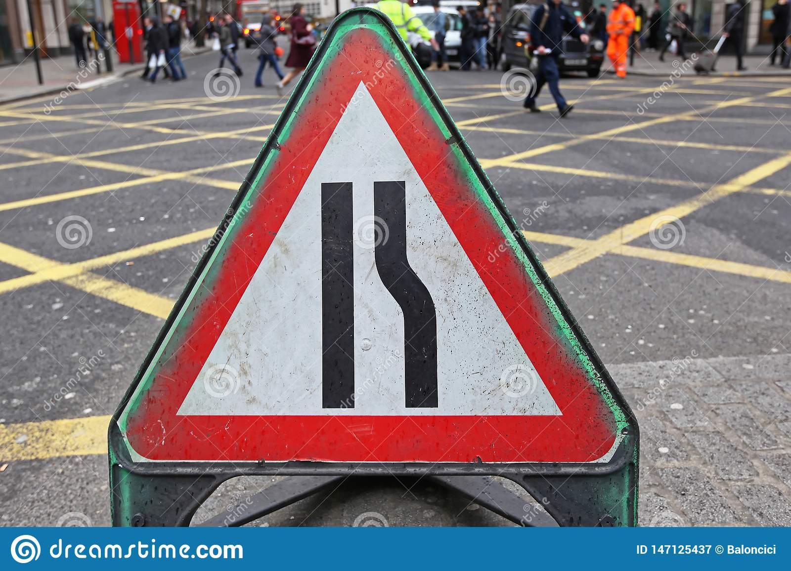

# **Traffic Sign Recognition** 

## Writeup

### You can use this file as a template for your writeup if you want to submit it as a markdown file, but feel free to use some other method and submit a pdf if you prefer.

---

**Build a Traffic Sign Recognition Project**

The goals / steps of this project are the following:
* Load the data set (see below for links to the project data set)
* Explore, summarize and visualize the data set
* Design, train and test a model architecture
* Use the model to make predictions on new images
* Analyze the softmax probabilities of the new images
* Summarize the results with a written report


[//]: # (Image References)

[image1]: ./figures/training-class-examples.png "Training Examples"
[image2]: ./figures/normalization-example.png "Normalization"
[image4]: ./net-images/class-41.jpg "Traffic Sign 41"
[image5]: ./net-images/class-29.jpg "Traffic Sign 29"
[image6]: ./net-images/class-42.png  "Traffic Sign 42"
[image7]: ./net-images/class-24.jpg "Traffic Sign 24"
[image8]: ./net-images/class-37.jpg "Traffic Sign 37"
[image9]: ./net-images/class-32.jpg "Traffic Sign 32"
[image10]: ./net-images/class-0.jpg "Traffic Sign 0"
[image11]: ./net-images/class-39.jpg "Traffic Sign 39"

## Rubric Points
### Here I will consider the [rubric points](https://review.udacity.com/#!/rubrics/481/view) individually and describe how I addressed each point in my implementation.  

---
### Writeup / README

#### 1. Provide a Writeup / README that includes all the rubric points and how you addressed each one. You can submit your writeup as markdown or pdf. You can use this template as a guide for writing the report. The submission includes the project code.

You're reading it! and here is a link to my [project code](https://github.com/mhardingr/CarND-Traffic-Sign-Classifier-Project/blob/master/Traffic_Sign_Classifier.ipynb)

### Data Set Summary & Exploration

#### 1. Provide a basic summary of the data set. In the code, the analysis should be done using python, numpy and/or pandas methods rather than hardcoding results manually.

I used the numpy library to calculate summary statistics of the traffic
signs data set:

* The size of training set is 34799
* The size of the validation set is 4410
* The size of test set is 12630
* The shape of a traffic sign image is (32, 32, 3)
* The number of unique classes/labels in the data set is 43

#### 2. Include an exploratory visualization of the dataset.

Below is a figure containing one training set example of each class followed by the distribution of each class across all datasets.
One thing that is easy to notice is that the level of illumination for training examples is highly variant - i.e. there are many dark training samples. This helps to motivate pre-processing steps such as color normalization (0-mean, stddev of 1), or perhaps (as was done in the provided benchmark [paper](http://yann.lecun.com/exdb/publis/pdf/sermanet-ijcnn-11.pdf) to normalize the luminance (Y) value of each image and even to ignore the color information altogether for state-of-the-art results. In addition, we notice from the distribution data that 15 classes have each less than 1% proportion of the training data. This motivates augmenting our datasets to at least generate more examples of these 15 classes for better "long-tail" performance, i.e. classify the rarer classes more robustly.

![Training examples for each class][image1]

```
Class 0:	Train %: 0.517	Valid %: 0.680	Test %: 0.475
Class 1:	Train %: 5.690	Valid %: 5.442	Test %: 5.701
Class 2:	Train %: 5.776	Valid %: 5.442	Test %: 5.938
Class 3:	Train %: 3.621	Valid %: 3.401	Test %: 3.563
Class 4:	Train %: 5.086	Valid %: 4.762	Test %: 5.226
Class 5:	Train %: 4.742	Valid %: 4.762	Test %: 4.988
Class 6:	Train %: 1.035	Valid %: 1.361	Test %: 1.188
Class 7:	Train %: 3.707	Valid %: 3.401	Test %: 3.563
Class 8:	Train %: 3.621	Valid %: 3.401	Test %: 3.563
Class 9:	Train %: 3.793	Valid %: 3.401	Test %: 3.800
Class 10:	Train %: 5.173	Valid %: 4.762	Test %: 5.226
Class 11:	Train %: 3.362	Valid %: 3.401	Test %: 3.325
Class 12:	Train %: 5.431	Valid %: 4.762	Test %: 5.463
Class 13:	Train %: 5.517	Valid %: 5.442	Test %: 5.701
Class 14:	Train %: 1.983	Valid %: 2.041	Test %: 2.138
Class 15:	Train %: 1.552	Valid %: 2.041	Test %: 1.663
Class 16:	Train %: 1.035	Valid %: 1.361	Test %: 1.188
Class 17:	Train %: 2.845	Valid %: 2.721	Test %: 2.850
Class 18:	Train %: 3.104	Valid %: 2.721	Test %: 3.088
Class 19:	Train %: 0.517	Valid %: 0.680	Test %: 0.475
Class 20:	Train %: 0.862	Valid %: 1.361	Test %: 0.713
Class 21:	Train %: 0.776	Valid %: 1.361	Test %: 0.713
Class 22:	Train %: 0.948	Valid %: 1.361	Test %: 0.950
Class 23:	Train %: 1.293	Valid %: 1.361	Test %: 1.188
Class 24:	Train %: 0.690	Valid %: 0.680	Test %: 0.713
Class 25:	Train %: 3.879	Valid %: 3.401	Test %: 3.800
Class 26:	Train %: 1.552	Valid %: 1.361	Test %: 1.425
Class 27:	Train %: 0.603	Valid %: 0.680	Test %: 0.475
Class 28:	Train %: 1.379	Valid %: 1.361	Test %: 1.188
Class 29:	Train %: 0.690	Valid %: 0.680	Test %: 0.713
Class 30:	Train %: 1.121	Valid %: 1.361	Test %: 1.188
Class 31:	Train %: 1.983	Valid %: 2.041	Test %: 2.138
Class 32:	Train %: 0.603	Valid %: 0.680	Test %: 0.475
Class 33:	Train %: 1.721	Valid %: 2.041	Test %: 1.663
Class 34:	Train %: 1.035	Valid %: 1.361	Test %: 0.950
Class 35:	Train %: 3.104	Valid %: 2.721	Test %: 3.088
Class 36:	Train %: 0.948	Valid %: 1.361	Test %: 0.950
Class 37:	Train %: 0.517	Valid %: 0.680	Test %: 0.475
Class 38:	Train %: 5.345	Valid %: 4.762	Test %: 5.463
Class 39:	Train %: 0.776	Valid %: 0.680	Test %: 0.713
Class 40:	Train %: 0.862	Valid %: 1.361	Test %: 0.713
Class 41:	Train %: 0.603	Valid %: 0.680	Test %: 0.475
Class 42:	Train %: 0.603	Valid %: 0.680	Test %: 0.713

```

### Design and Test a Model Architecture

#### 1. Describe how you preprocessed the image data. What techniques were chosen and why did you choose these techniques? Consider including images showing the output of each preprocessing technique. Pre-processing refers to techniques such as converting to grayscale, normalization, etc. (OPTIONAL: As described in the "Stand Out Suggestions" part of the rubric, if you generated additional data for training, describe why you decided to generate additional data, how you generated the data, and provide example images of the additional data. Then describe the characteristics of the augmented training set like number of images in the set, number of images for each class, etc.)

I committed only to minimal pre-processing: normalization of all 3 color channels to 0-mean and stddev of 1.0. This was necessary
to facilitate gradient descent over the many parameters in the neural network. My hope was that the network would be able to do the heavy lifting, even if more epochs were required, instead of require most of the images be digested for it.

The figure below appears to show the same image, however the left is the original image (RGB, unnormalized) and the right is normalized (rescaled and recentered to fit within range [0, 1.0]). The right is what was fed in as input.

![Normalization][image2]


#### 2. Describe what your final model architecture looks like including model type, layers, layer sizes, connectivity, etc.) Consider including a diagram and/or table describing the final model.

My final model consisted of the following layers:

| Layer         		|     Description	        					| 
|:---------------------:|:---------------------------------------------:| 
| Input         		| 32x32x3 RGB image   							| 
| Convolution 5x5     	| 1x1 stride, no padding, outputs 28x28x16 		|
| RELU					|												|
| Max pooling	      	| 2x2 stride,  outputs 14x14x16 				|
| Convolution 5x5	    | 1x1 stride, no padding, outputs 10x10x32 		|
| RELU					|												|
| Max pooling	      	| 2x2 stride,  outputs 5x5x32  					|
| Flatten 				|   											|
| Fully connected		| 800x120 										|
| RELU					|												|
| Dropout 				|    											|
| Fully connected		| 120x84        								|
| RELU					|												|
| Dropout 				|    											|
| Fully connected		| 84x10     									|
| Softmax				| 10->10       									|
|						|												|
|						|												|
 


#### 3. Describe how you trained your model. The discussion can include the type of optimizer, the batch size, number of epochs and any hyperparameters such as learning rate.

While training, I used the following parameters in addition to the Adam optimizer and a standard cross-entropy loss:
```
lr = 0.001
train_keep_prob = 0.5
BATCH_SIZE = 32
EPOCHS = 20
```

After the minimum threshold value of 93% validation accuracy, the training procedure will save the best performing model as a high-watermark, and label the checkpointed parameters with the validation accuracy they achieved. In this manner, training achieved 97.0% validation accuracy and saved the parameter values in `./TSNet-vacc-0.970`.

#### 4. Describe the approach taken for finding a solution and getting the validation set accuracy to be at least 0.93. Include in the discussion the results on the training, validation and test sets and where in the code these were calculated. Your approach may have been an iterative process, in which case, outline the steps you took to get to the final solution and why you chose those steps. Perhaps your solution involved an already well known implementation or architecture. In this case, discuss why you think the architecture is suitable for the current problem.

My final model results were:
* training set accuracy of 99.8%
* validation set accuracy of 97.0% 
* test set accuracy of 95.3%

The first architecture that I tried was the vanilla LeNet that worked on the letters dataset. I had first expanded the depth of the
original network's input, and expanded the number of logits to match the 43 classes. This achieved a validation accuracy below 80%. It appears that overfitting may have been occuring which motivates introducing modern-standard regularization.
My next iteration, I liberally introduced Dropout layers after the activations of both the 2 convolutional layers and 2 fully connected layers, all using the same training "keep probability" of 0.5.
This did not improve learning performance as signficantly as expected (since Dropout is a state-of-the-art regularizer that was not used in the benchmark architecture). Even increasing the Adam's initial learning rate was not going to get the validation accuracy to go above 93%. This must mean the problem is not with the learning rate, but perhaps too strong of a regularizer leading and overall fewer informative features being learned and sought in new images.
I read online that the best practices for adding Dropout layers was to include them only on layers that we want to make more sparse - i.e. the fully connected layers since they contain many parallely-trained parameters. 
Dropout on convolution layers isn't as helpful so long as the number of epochs is low and the "keep probability" is too balanced (i.e. 0.5). Therefore, I decided to remove the Dropout layers after the convolutional activations.
Another improvement in the learning and regularization of the model was introduced by expanding convolutional outputs from the original LeNet values: the first convolutional layer would have 16 feature maps, and the second would have 32.
This effectively expands the number of low-level and composite shapes and curves the network could find in the traffic sign images. I kept the number of internal feature maps low (especially compared to the "sermanet" paper, which used a number feature maps in the 1000s for the second convolutional layer) because I believe that the number of shapes and unique edges for the traffic sign dataset to be quite low, though not as low as the letters dataset.
With this final architecture, I trained for 20 epochs and saved the best performing set of parameters for the model, which achieved 97% validation accuracy.


### Test a Model on New Images

#### 1. Choose five German traffic signs found on the web and provide them in the report. For each image, discuss what quality or qualities might be difficult to classify.

Here are eight German traffic signs that I found on the web:





These images taken from the internet all have one thing in common: they included "stock photo" watermarks as artifacts peppered all over the image. If downsampling doesn't do away with most of these artifacts, then the added input noise may be more than what trained network is robust to. However, the greater factor for misclassification is that all 8 images represent under-trained classes (i.e. under ~1% of the training set), which happened to also be under-represented in the validation and test set. These are therefore the most difficult classify correctly for my model because they were not seen nearly as often as other classes.
The speed limit sign shares a lot in common with the more well-represented other speed limit classes, so this may be easier to classify if the model learned to generalize features across speed limit signs.
The bicycle cross sign may, for the same reason, be easily mistaken for a speed limit sign.
The first, third, and sixth images, which represent "End of ..." classes, may be the most difficult to classify correctly since they represent  rare and unique classes from the training set.
The fourth image repesents another rare and unique class: "Road narrows on the right".
Lastly, the fifth and eight images are both similar in color and in common use of white arrows, of which are present in more common classes like "roundabout" and "ahead only" - there may be a chance these could be classified correctly using information from these related and more common classes.

#### 2. Discuss the model's predictions on these new traffic signs and compare the results to predicting on the test set. At a minimum, discuss what the predictions were, the accuracy on these new predictions, and compare the accuracy to the accuracy on the test set (OPTIONAL: Discuss the results in more detail as described in the "Stand Out Suggestions" part of the rubric).

Here are the results of the prediction:

| Image										        |     Prediction	        					| 
|:-------------------------------------------------:|:---------------------------------------------:| 
| End of no passing									| End of no passing								| 
| Bicycles cross									| Speed limit (50km/h)							|
| End of no passing by vehicles over 3.5 metric tons| End of no passing								|
| Road narrows on the right	      	 	 	 		| Pedestrians					 				|
| Go straight or left								| Turn right ahead     							|
| End of all speed and passing limits				| End of no passing								|
| Speed limit (20km/h)	      			      		| Speed limit (20km/h)			 				|
| Keep left											| Keep left      								|


The model was able to correctly predict 3 of the 8 traffic signs, which gives an accuracy of 37.5%. This is much lower than the accuracy on the original test set because we hand-picked the rarest classes to test, so we've greatly biased the new test set to evaluate the generalization power of our model on the most difficult class examples.

#### 3. Describe how certain the model is when predicting on each of the five new images by looking at the softmax probabilities for each prediction. Provide the top 5 softmax probabilities for each image along with the sign type of each probability. (OPTIONAL: as described in the "Stand Out Suggestions" part of the rubric, visualizations can also be provided such as bar charts)

The code for making predictions on my final model is located in the 23rd cell of the Ipython notebook.

For the first image, the model is relatively sure that this is the right class (probability of >99%). The top five soft max probabilities were

| Probability         	|     Prediction	        					| 
|:---------------------:|:---------------------------------------------:| 
| 99.97577%    			| End of no passing								| 
| 0.02410% 				| Dangerous curve to the right					|
| 0.00012%				| No passing									|
| 0.00000%    			| Priority Road					 				|
| 0.00000%			    | No passing for vehicles over 3.5 metric tons	|

For the second image, the model was very certain ofthe wrong label. In fact, though the image actually contained a "bicycle cross" sign, the model seemed to only want to guess it was any of the speed limit signs. 

| Probability         	|     Prediction	        					| 
|:---------------------:|:---------------------------------------------:| 
| 99.85815%    			| Speed limit (50km/h)							| 
| 0.07626%				| Speed limit (30km/h)							|
| 0.06229%				| Speed limit (80km/h)							|
| 0.00313%     			| Speed limit (60km/h)			 				|
| 0.00011%			    | Speed limit (100km/h)							|


For the third image, the model was very certain of the wrong but similar "End of ..." label (the corect label was its second choice).

| Probability         	|     Prediction	        						| 
|:---------------------:|:-------------------------------------------------:| 
| 96.00199% 			| End of no passing									| 
| 3.95798%				| End of no passing by vehicles over 3.5 metric tons|
| 0.03965%				| End of all speed and passing limits				|
| 0.00025%     			| End of speed limit (80km/h)	 					|
| 0.00011%			    | Turn left ahead 									|


For the fourth image, the true label is "Road narrows on the right", however the model appeared unable to commit to either of its
top 2 choices, which were both wrong (i.e. "Pedestrians", and "General caution"). Since the probability of the top prediction is below 50%, we can assume the model was so unsure that it probably should avoid predicting at all.

| Probability         	|     Prediction	        					| 
|:---------------------:|:---------------------------------------------:| 
| 45.90675%   			| Pedestrians   								| 
| 44.54217%				| General caution								|
| 5.43974%				| Road narrows on the right						|
| 3.83496%     			| Right-of-way at the next intersection			|
| .09287%			    | Traffic signals								|


For the fifth image, the correct label is "Go straight or left". The model (with high certainty) mistook this sign for a "Turn right ahead" sign - it happens that this sign is also a mostly blue sign with a white arrow. Unfortunately, the arrow is not nearly pointed in the same direction as in this input image.

| Probability         	|     Prediction	        					| 
|:---------------------:|:---------------------------------------------:| 
| 97.97249%    			| Turn right ahead								| 
| 0.86607%				| Go straight or right							|
| 0.66615%				| Roundabout mandatory							|
| 0.43300%     			| Speed limit (50km/h)			 				|
| 0.05668%			    | Speed limit (30km/h)							|

For the sixth image, the correct label is "End of all speed and passing limits".
The model instead was pretty certain of a similar (but still incorrect) "End of ..." label: "End of no passing".

| Probability         	|     Prediction	        						| 
|:---------------------:|:-------------------------------------------------:| 
| 85.76002%    			| End of no passing									| 
| 12.89723%				| End of all speed and passing limits				|
| 1.24833%				| End of no passing by vehicles over 3.5 metric tons|
| 0.08293%     			| End of speed limit (80km/h)						|
| 0.00491%			    | Vehicles over 3.5 metric tons prohibited			|


For the seventh image, our model was certain in predicting the correct label: Speed limit (20km/h).

| Probability         	|     Prediction	        					| 
|:---------------------:|:---------------------------------------------:| 
| 90.06441%   			| Speed limit (20km/h)							| 
| 8.97262%)				| Speed limit (30km/h)							|
| 0.37717%				| Speed limit (50km/h)							|
| 0.17857%     			| Speed limit (120km/h			 				|
| 0.09784%			    | Vehicles over 3.5 metric tons prohibited		|


For the eighth image, our model was certain of the correct label as well: Keep left.

| Probability         	|     Prediction	        					| 
|:---------------------:|:---------------------------------------------:| 
| 98.89015%    			| Keep left 									| 
| 0.94130% 				| Go straight or left							|
| 0.16808%				| Roundabout mandatory							|
| 0.00027%     			| Turn right ahead				 				|
| 0.00020%			    | Speed limit (70km/h) 							|


### (Optional) Visualizing the Neural Network (See Step 4 of the Ipython notebook for more details)
#### 1. Discuss the visual output of your trained network's feature maps. What characteristics did the neural network use to make classifications?


